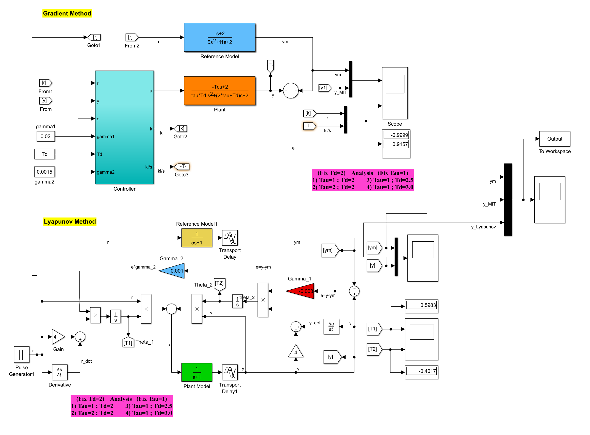
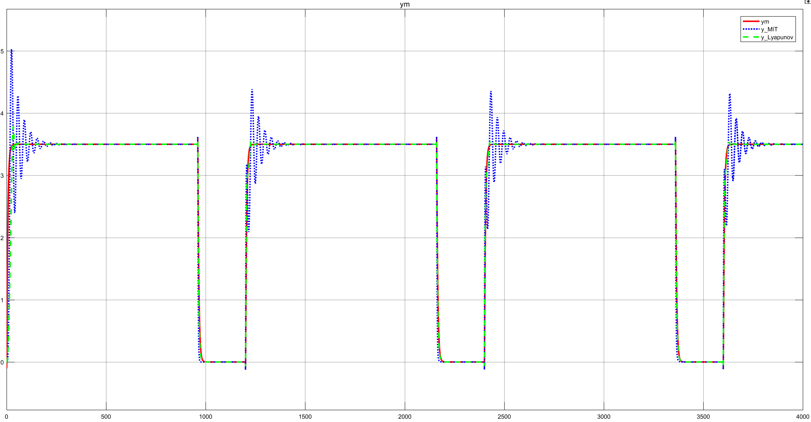

# Model Reference Adaptive Control for a chemical process.

This project is a Matlab simulation of MRAC for chemical process. Two types of MRAC are simulated: 

  - Gradient Method
  - Lyapunov Method

# Simulation

The simulation contains two redundant copies of the plant and the reference model. init.m file need to be run before running the MRAC.slx file. 

for tau=2 and Td=0.5 the simulation result below shows that Lyapunov converges faster and have lower overshoot that MIT gradient method. 

For more details please read the attached paper. 

