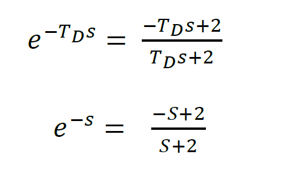
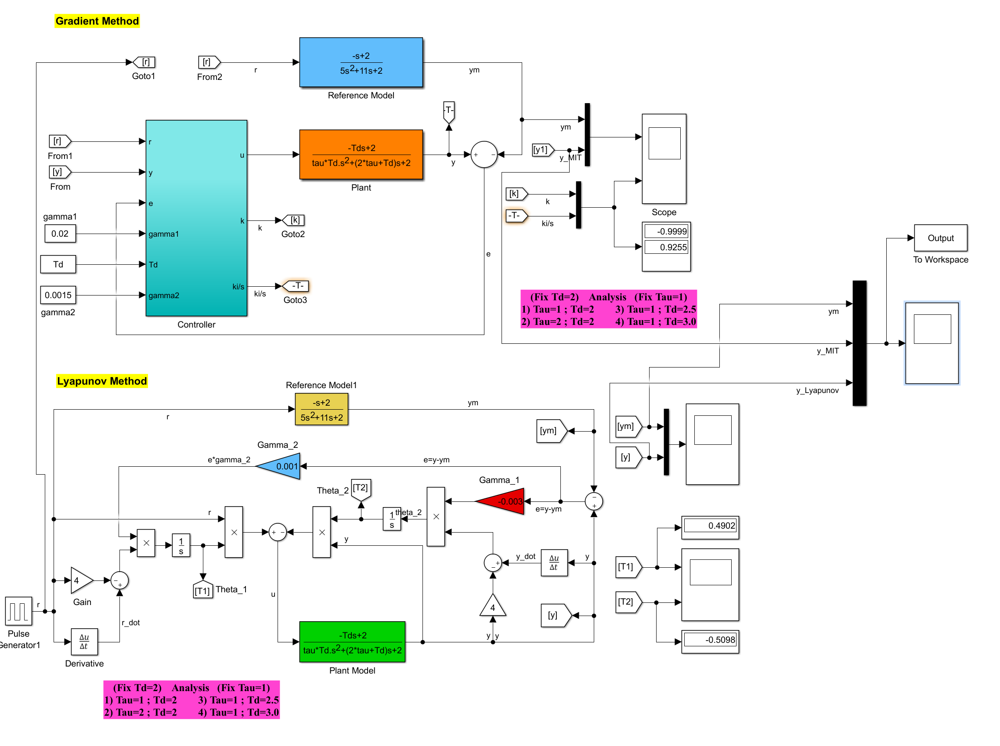

# Model Reference Adaptive Control for a chemical process.

This project is a Matlab simulation of MRAC for a chemical process. Two types of MRAC are simulated: 

  - Gradient Method
  - Lyapunov Method

# MRAC 

The block diagram of MRAC is as follows: 

The plant to be controlled is: 

where Td and tau are unknown. 

The reference model to be tracked is: 

The controller is a PI controller with the following equation: 

Time delay is represented by a non-linear transfer function. However, Pade approximation estimates the delay with the following linear transfer function for the plant and the reference model, respectively.

The plant model becomes: 

Whereas the reference model becomes: 

# Simulation

The simulation contains two redundant copies of the plant and the reference model. init.m file need to be run before running the MRAC.slx file. Many options of tau and Td could be explored to compare the performances of the two MRAC methods. 

In this simulation tau=2 and Td=0.5, the simulation result below shows that Lyapunov converges faster and have lower overshoot than that for MIT gradient method. 

For more details please read the attached paper. 

